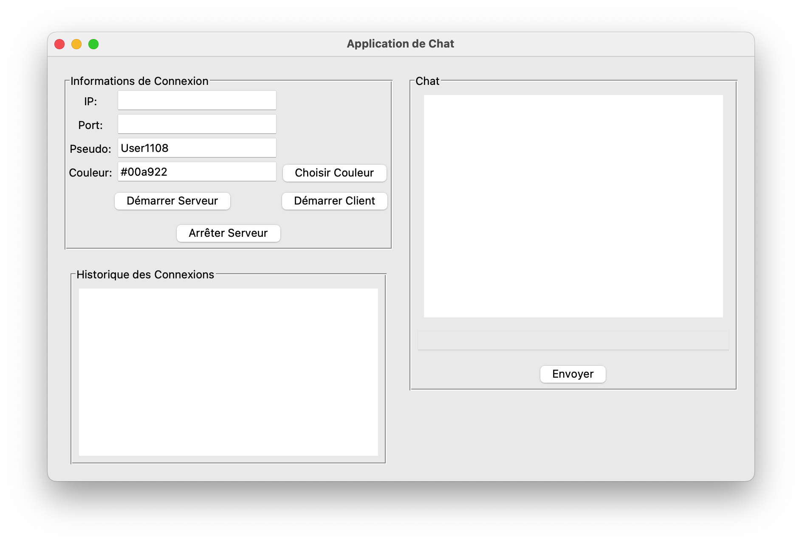
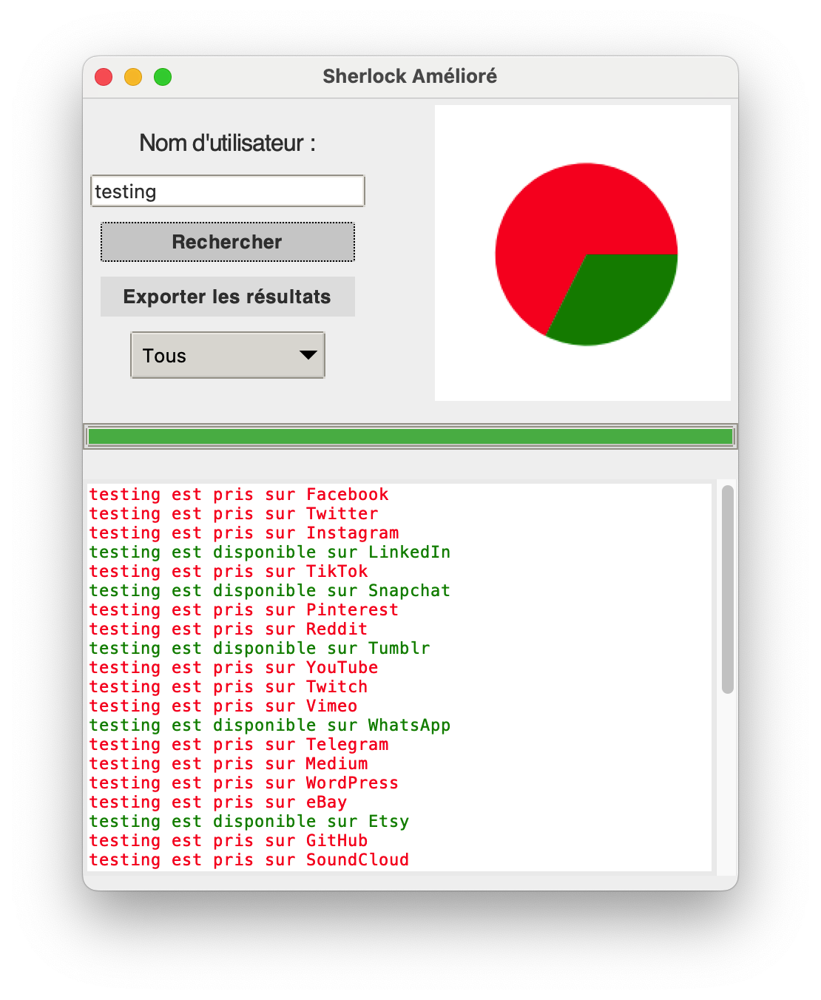
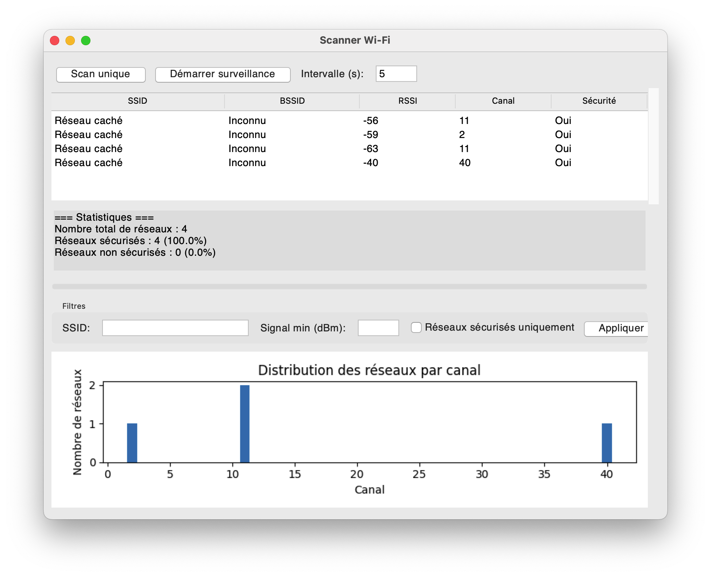

# Mes outils
## Dépendance a installer pour le projet
	•	aiohttp (pour les requêtes asynchrones)
	•	Pillow (pour manipuler les images, en remplacement de PIL)
	•	matplotlib (pour les graphiques et l’intégration avec Tkinter)
	•	cryptography (pour le module Fernet)

````python
pip install aiohttp pillow matplotlib cryptography
````

#### clonner le repository 
```bash
cd /path/to/your/project
git clone https://github.com/S0M2/utils-PY.git
```
## Prérequis spécifiques selon ton OS
#### Tkinter :
	•	Sous Windows et macOS, Tkinter est généralement inclus avec Python.
	•	Sous Linux, il se peut que tu doives installer Tkinter via ton gestionnaire de paquets, par exemple pour Ubuntu/Debian :
#### Core WLAN
```bash
pip install pyobjc-framework-CoreWLAN
```

Ouvre ton terminal et exécute :

````bash
sudo apt-get install python3-tk
````
## Screenshots






## Authors

- [@S0M2](https://www.github.com/S0M2)

